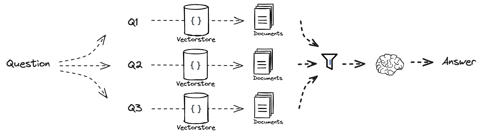
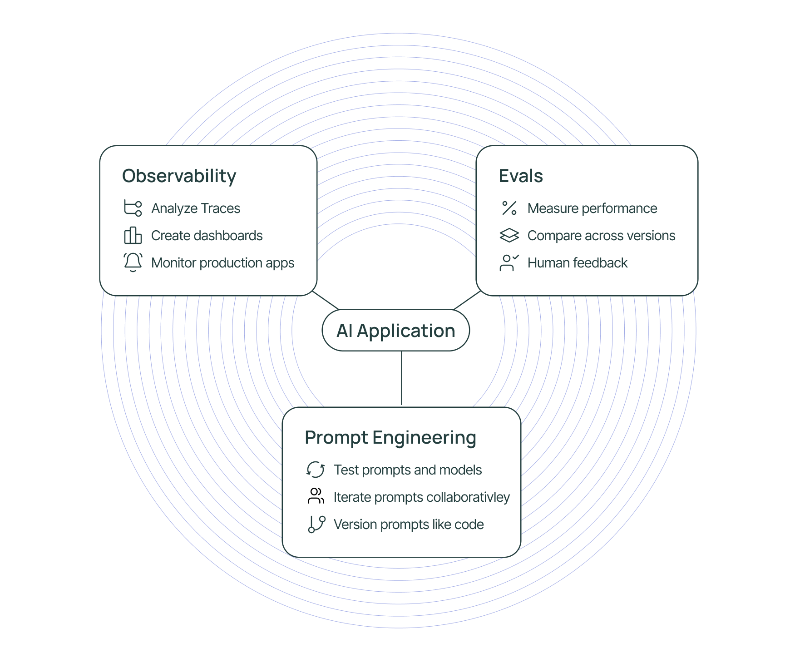
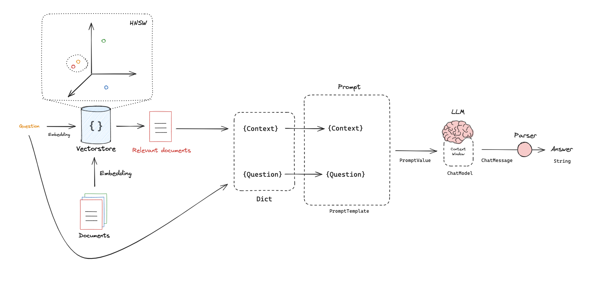

## Original Github
https://github.com/langchain-ai/rag-from-scratch/blob/main/rag_from_scratch_5_to_9.ipynb

## Install Milvus

using docker compose <Marium attached link>

# Start Milvus
$ sudo docker compose up -d

## check Milvus
Milvus UI - Attu :  0.0.0.0:8000

https://python.langchain.com/docs/integrations/vectorstores/milvus/

## activate environment

source venv/bin/activate

## OpenAI 

https://platform.openai.com/api-keys

## RAG - Fusion
https://github.com/langchain-ai/langchain/blob/master/cookbook/rag_fusion.ipynb?ref=blog.langchain.dev

Retrieval-Augmented Generation (RAG) is a technique that enhances the capabilities of language models by integrating external knowledge sources into the generation process. This approach allows models to access up-to-date information beyond their training data, improving the accuracy and relevance of their responses.

**RAG-Fusion** is an advanced variant of RAG designed to handle complex or ambiguous queries more effectively. Here's a step-by-step breakdown of how RAG-Fusion operates:

1. **Query Decomposition**: When a user submits a complex query, RAG-Fusion first breaks it down into multiple related sub-queries. This decomposition ensures that different facets of the original question are addressed.
2. **Parallel Retrieval**: Each sub-query is processed independently to retrieve relevant documents or information. This parallel retrieval ensures a comprehensive collection of data pertinent to the various aspects of the original query.
3. **Reciprocal Rank Fusion (RRF)**: The retrieved documents from all sub-queries are then ranked using the RRF method. RRF assigns scores to documents based on their ranks across multiple retrieval lists, promoting those that are consistently relevant.
4. **Response Generation**: The top-ranked documents are combined and fed into a language model to generate a coherent and informative response to the user's original query.

# LangSmith

Observability
Analyze traces in LangSmith and configure metrics, dashboards, alerts based on these.

Evals
Evaluate your application over production traffic — score application performance and get human feedback on your data.

Prompt Engineering
Iterate on prompts, with automatic version control and collaboration features.

## Indexing

# End of End Retrival 

